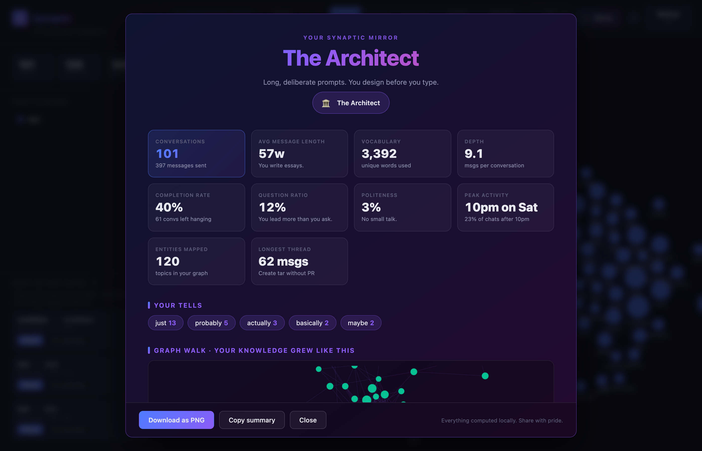

<p align="center">
  
</p>

<h1 align="center">Synaptic</h1>

<p align="center">
  <strong>You've had 500 AI conversations. What have you actually learned?</strong>
</p>

<p align="center">
  <a href="#-30-second-demo">30s Demo</a> •
  <a href="#-why-synaptic">Why</a> •
  <a href="#-quick-start">Quick Start</a> •
  <a href="#-cli">CLI</a> •
  <a href="#-how-it-works">How It Works</a>
</p>

<p align="center">
  
  
  
  
  
</p>

<p align="center">
  
</p>

---

Synaptic reads your **ChatGPT** and **Claude** conversation exports and turns them into an interactive knowledge graph — so you can finally see what you've been building, learning, and asking about across hundreds of AI conversations.

**No install. No server. No API keys. Just open the HTML file.**

> *"I exported 400 ChatGPT conversations and realized I've asked about Kubernetes networking 23 times without ever finishing my setup."*

## 🎯 Why Synaptic?

**The problem is real.** ChatGPT's search is terrible. Claude doesn't even let you search history. People have hundreds of AI conversations with zero way to see patterns, find old discussions, or understand what they've actually learned.

OpenAI [literally lost people's chat history](https://community.openai.com/t/chatgpt-chat-history-disappears/1343593) in 2025. Your AI conversations are valuable knowledge — but they're trapped in a black box you don't control.

Synaptic gives you that control:

- **See your AI brain** — a force-directed graph showing every topic, tool, and person you've discussed
- **Find hidden patterns** — discover that you keep asking about the same things, or see unexpected connections between projects
- **Track your learning** — timeline view shows how your interests evolve over weeks and months
- **Own your data** — everything runs in your browser. Your conversations never leave your machine

## ⚡ 30-Second Demo

```bash
# Option A: Just download and open
curl -O https://raw.githubusercontent.com/Suryanshj45/synaptic/main/index.html
open index.html  # Click "Try Demo Data" to explore

# Option B: Clone the repo
git clone https://github.com/Suryanshj45/synaptic.git
open synaptic/index.html
```

Or literally just download `index.html` and double-click it. That's the whole app.

**To use your own data:**

1. Export from [ChatGPT](https://help.openai.com/en/articles/7260999-how-do-i-export-my-chatgpt-history-and-data) (Settings → Data Controls → Export) or [Claude](https://support.claude.com/en/articles/9450526-how-can-i-export-my-claude-data) (Settings → Export)
2. Drop the JSON file onto Synaptic
3. Watch your knowledge graph come alive

## 🔍 What You'll Discover

### Graph View
An interactive D3.js force-directed graph where nodes are **people**, **technologies**, and **concepts** you've discussed. Node size = mention frequency. Node color = topic cluster. Lines = topics discussed together. Drag, zoom, click, explore.

<p align="center"></p>

### Timeline View
Your conversations laid out chronologically with auto-extracted topics. See exactly when you started learning React, when you switched to Rust, and whether you ever finished that Kubernetes migration.

### Analytics View
Bar charts and stats: most-discussed entities, most-connected hub topics, entity type breakdown, and conversation volume over time. Quantify your AI usage for the first time.

<p align="center"></p>

### Full-Text Search (⌘K)
Hit **⌘K** (or **Ctrl+K**) to search every message across every conversation. Fuzzy matching tolerates typos, results are ranked by relevance with title boosting, and matching terms are highlighted right in the snippet. Click a result to jump straight to that message in the conversation viewer.

Powered by [MiniSearch](https://github.com/lucaong/minisearch) (MIT, BM25, fuzzy + prefix). Falls back to substring search if you're fully offline.

### Persistent Sessions
Your imported conversations are saved locally in your browser (IndexedDB) and automatically restored on reload — no need to re-import every time. Hit **Clear** to wipe local storage when you want.

### Loose Ends
*"I asked about Kubernetes 23 times without ever finishing my setup."* — the tagline on this project finally has a feature behind it.

The **Loose Ends** view surfaces four kinds of unresolved threads:

- **Hanging Question** — conversations that end on a user question with no resolution signal anywhere.
- **Follow-up Pending** — you said *"I'll try this and get back"* but never confirmed it worked.
- **Repeated / Unresolved** — a topic discussed across 3+ conversations with zero *"it works / fixed / solved"* markers.
- **Dormant Topic** — a previously-hot topic that went silent 60+ days ago without resolution.

Click any item to jump to the conversation at the relevant message. Items are ranked by severity; a preview of the top few also appears in the sidebar.

### Context Bundles
The feature nobody else has. One click, and Synaptic builds a resumable prompt from your past conversations about any topic — ready to paste into a fresh ChatGPT, Claude, or Cursor chat.

A bundle contains:

- **What you were working on** — seed question from the earliest relevant conversation.
- **Prior conversations** — title, date, question you asked, and the key takeaway from each.
- **Decisions & recommendations** — extracted from the conversation text (phrases like *"I'd recommend"*, *"go with"*, *"switched to"*).
- **Code shared so far** — up to three deduplicated code blocks from the thread.
- **Related topics** — co-mentioned entities from the graph.
- **Where you left off** — open questions and promises to report back.

Generate from:

- Entity detail panel → **⚡ Generate Context Bundle**
- Any Loose End card → **⚡ Build context bundle**
- Conversation viewer → **Bundle** button in the header

Copy to clipboard or download as Markdown. All pure template extraction — no LLM, no API calls, runs in milliseconds.

### Annotations (pin / tag / note / status)
Every conversation and every entity gets a lightweight annotation layer:

- **★ Pin** — surface important items in a dedicated sidebar section
- **Status** — `open` / `in progress` / `resolved` / `abandoned` (shows as a colored pill in the timeline)
- **#tags** — lowercase free-form tags, chip-style UI, typed inline
- **Private note** — anything you want, scoped to that item, up to 2,000 chars

Everything persists to IndexedDB automatically and rides along in backup exports. No server, no sync — just your local layer of meaning on top of the AI's output.

### Secret Redaction (pre-import)
Before a single byte of your export enters the graph, Synaptic scans for secrets using 14 regex patterns inspired by [gitleaks](https://github.com/gitleaks/gitleaks) and [detect-secrets](https://github.com/Yelp/detect-secrets):

OpenAI / Anthropic / GitHub / GitLab / AWS / Google / Slack / Stripe / JWT / private-key blocks / emails / phone numbers / credit cards (Luhn-validated) / IPv4 addresses.

A modal pops up listing every category, count, and obfuscated sample — you pick which to redact, and the import proceeds with those values replaced by `[REDACTED:TYPE]` tokens. Nothing leaves your browser. Nothing is logged.

### Alias Clustering (merge "k8s" ↔ "Kubernetes")
The entity extractor is aggressive by design, which means it catches both `k8s` and `Kubernetes` as separate nodes. Synaptic runs a fuzzy-matching pass (Levenshtein + abbreviation heuristics + substring detection) and surfaces merge suggestions in the sidebar:

> **Kubernetes ↔ k8s** · 90% match · 47 + 12 · `[ Merge ] [ Not duplicates ]`

Accepting merges entities cleanly (counts combine, links redirect, annotations carry over). Rejections are remembered so the same false positive never appears twice.

### Backup Export / Import
One-click full-snapshot export as a portable JSON file — conversations, entities, clusters, annotations, merge decisions, quality scores, everything. Drop that file back in on another device, another browser, after clearing cache, whenever. This is your cross-device sync, with zero servers involved.

### Quality Scoring
Every conversation gets a 0–100 usefulness score based on depth (user + assistant turn counts), code presence, resolution signals, assistant reasoning length, and entity richness. Shown as a colored bar in the timeline and entity mentions list. High-quality conversations float visually above the noise.

### Déjà Vu Detector
Open a conversation and Synaptic instantly checks whether you've touched the same entity cluster in earlier chats. If there's overlap, a subtle banner appears at the top of the conversation viewer:

> *∞ You've touched these topics in 4 earlier conversations.* → **Show me**

Click to expand the list, click any item to jump there. Useful for catching "oh I literally asked about this in March and forgot."

### Your AI Year
A narrative view — think Spotify Wrapped for your AI brain. Synaptic groups conversations by month and auto-writes prose:

> *March 2025 — **Kubernetes** dominated — 23 mentions across 9 conversations. New on your radar: Helm, Ingress. Quietly dropped: Redis. Avg quality: 68/100 (medium).*

No LLM. No API calls. Pure template over signal. Perfect for reflecting on a year of thinking-with-AI.

### Synaptic Mirror ✨
Click the **✨ Mirror** button in the toolbar for a shareable, personal reveal of how you use AI.

Synaptic computes your **archetype** — are you The Midnight Debugger, The Patient Perfectionist, The Power User, The Architect, or The Student? — from message length, time-of-day patterns, completion rate, politeness, and question ratio. It surfaces your personal **tells** (the filler words you lean on — "actually", "basically", "just"), your knowledge graph growing as a **time-lapse animation**, and a **Hallucination Hall of Fame** that flags AI responses full of hedge phrases like *"as of my training data"* or *"please verify with official docs"*.

<p align="center"></p>

One-click **Download as PNG** produces a crisp shareable card. Nothing ever leaves your browser. It's Spotify Wrapped for your brain — rendered entirely by your own device from your own data.

## 💻 CLI

Zero-dependency Python CLI for terminal-native workflows and scripting:

```bash
# See what you've been learning
python cli/synaptic.py analyze your_export.json

# Generate a Mermaid diagram for your docs
python cli/synaptic.py graph your_export.json --output knowledge.mermaid

# Export for spreadsheet analysis
python cli/synaptic.py export your_export.json --format csv

# Quick stats
python cli/synaptic.py stats your_export.json
```

```
  S Y N A P T I C
  AI Conversation Intelligence
  ────────────────────────────────────────

  ✓ Parsed 247 conversations

  Overview
  ────────────────────────────────
  Conversations    247
  Total messages   1,842
  Total words      312,506
  Entities found   120
  Relationships    298

  Top Entities
  ────────────────────────────────
  ● react              ████████████████████████████░░ 47
  ● python             █████████████████████████░░░░░ 41
  ● typescript          ████████████████████░░░░░░░░░░ 33
  ● docker             ███████████████░░░░░░░░░░░░░░░ 24
  ● postgresql          ██████████████░░░░░░░░░░░░░░░░ 22
```

### Export Formats

| Format | Command | Use Case |
|--------|---------|----------|
| Terminal | `analyze` | Quick overview with colored bars |
| JSON | `--format json` | Programmatic access |
| CSV | `--format csv` | Spreadsheets, pandas, R |
| Mermaid | `graph` | Embed in docs and READMEs |
| [MemPalace](https://github.com/MemPalace/mempalace) | `--format mempalace` | 3D knowledge palace |

## 🧠 How It Works

No ML models. No API calls. No dependencies. Just smart pattern matching:

1. **Parses** ChatGPT/Claude JSON exports (auto-detects format)
2. **Extracts entities** — proper nouns (people), 100+ tech terms (tools/languages), quoted phrases (concepts), frequent domain words
3. **Builds a graph** — entities that appear in the same conversation are linked, with weight proportional to co-occurrence frequency
4. **Clusters topics** — connected component analysis groups related entities automatically
5. **Renders** as an interactive D3.js force-directed graph, timeline, or analytics dashboard

The web app is a **single HTML file** (~58KB). The CLI is a **single Python file** with zero imports beyond the standard library. Both are designed to work forever without breaking.

## 🔒 Privacy

This isn't a marketing bullet point — it's the core architecture:

- The web app runs 100% in your browser. There is no server.
- The CLI runs 100% on your machine. There are no network calls.
- No analytics. No tracking. No cookies. No telemetry.
- Works offline. Works air-gapped. Works in 2030.

Your AI conversations contain sensitive information — project plans, code, personal questions. Synaptic is built so you never have to trust anyone with that data.

## 🗺️ Roadmap

- [x] Full-text search across all messages (⌘K)
- [x] Persistent local sessions via IndexedDB
- [x] Loose Ends detector — surface unresolved threads and repeated questions
- [x] Context Bundles — export past discussion as a resumable prompt
- [x] Annotations layer — pin, tag, note, mark status on entities + conversations
- [x] Secret-redaction pre-scan — scrub API keys / emails / phones before ingestion
- [x] Alias clustering — merge near-duplicate entities (k8s ↔ Kubernetes)
- [x] Backup export / import — single-file JSON snapshots for cross-device sync
- [x] Quality scoring — rank conversations by depth, resolution, and reasoning
- [x] Déjà vu detector — spot when a new chat overlaps past discussions
- [x] "Your AI Year" — auto-generated monthly narrative of your knowledge journey
- [x] Synaptic Mirror — personal archetype, quirks, graph time-lapse, hallucination flags, PNG export
- [ ] Incremental import with diff view
- [ ] Multi-file merge — combine exports from different AI assistants
- [ ] Gemini / Copilot / Grok import support
- [ ] MCP Server — use Synaptic as a tool inside Claude Code / Cursor
- [ ] Sigma.js render at scale (500+ nodes)
- [ ] compromise.cool / transformers.js NER (opt-in, lazy-loaded)
- [ ] Semantic search with local embeddings
- [ ] Time-diff view — compare your knowledge graph across months
- [ ] PDF/PNG export for sharing

## 🤝 Contributing

Contributions welcome! The codebase is intentionally simple:

- **Web app** — one HTML file, edit and refresh
- **CLI** — one Python file, zero deps
- **Tests** — `python tests/generate_test_data.py` then `python cli/synaptic.py analyze`

```bash
git clone https://github.com/Suryanshj45/synaptic.git
cd synaptic

# Test everything works
python cli/synaptic.py analyze examples/sample-export.json
open index.html  # Click "Try Demo Data"
```

## Similar Projects

| Project | Stars | Approach | Difference |
|---------|-------|----------|------------|
| [chatgpt-exporter](https://github.com/pionxzh/chatgpt-exporter) | 2.1k | Browser extension for exporting | Export only, no analysis |
| [convoviz](https://github.com/mohamed-chs/convoviz) | 844 | Word clouds + markdown | No graph, Python-only |
| [MyChatArchive](https://github.com/1ch1n/mychatarchive) | — | Semantic search via MCP | Requires embedding setup |
| **Synaptic** | — | Interactive knowledge graph | Zero-install, runs in browser |

## License

MIT — do whatever you want. See [LICENSE](LICENSE).

---

<p align="center">
  <strong>Built because I had 500 AI conversations and couldn't remember any of them.</strong>
  <br/>
  <sub>If you've felt the same way, give this a ⭐ and share it with someone who lives in ChatGPT.</sub>
</p>
</content>
</invoke>