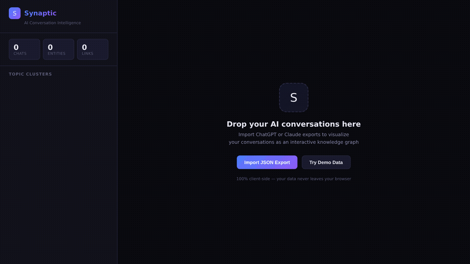
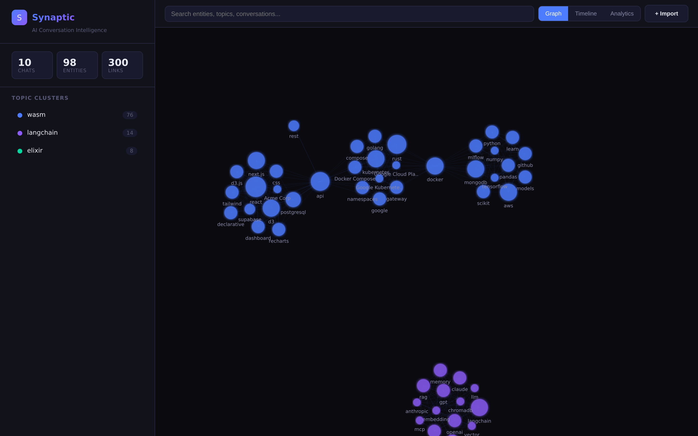
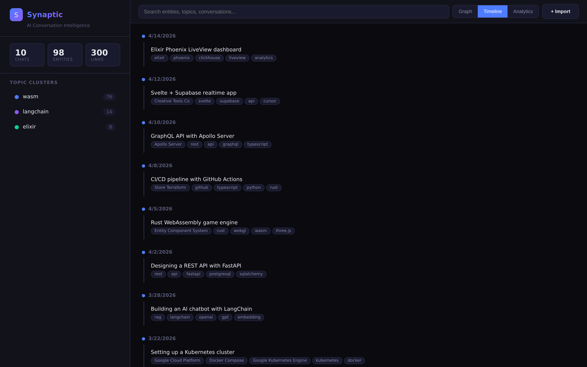
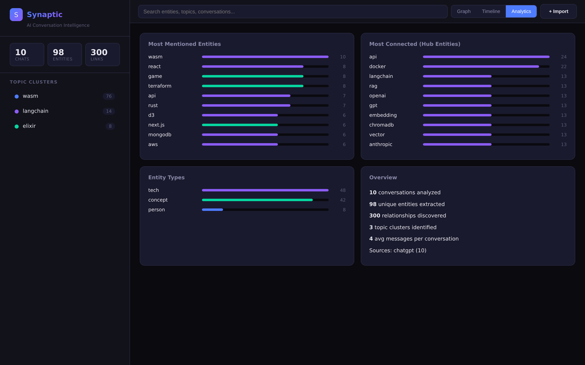

<p align="center">
  
</p>

<h1 align="center">Synaptic</h1>

<p align="center">
  <strong>You've had 500 AI conversations. What have you actually learned?</strong>
</p>

<p align="center">
  <a href="#-30-second-demo">30s Demo</a> •
  <a href="#-why-synaptic">Why</a> •
  <a href="#-quick-start">Quick Start</a> •
  <a href="#-cli">CLI</a> •
  <a href="#-how-it-works">How It Works</a>
</p>

<p align="center">
  
  
  
  
  
</p>

<p align="center">
  
</p>

---

Synaptic reads your **ChatGPT** and **Claude** conversation exports and turns them into an interactive knowledge graph — so you can finally see what you've been building, learning, and asking about across hundreds of AI conversations.

**No install. No server. No API keys. Just open the HTML file.**

> *"I exported 400 ChatGPT conversations and realized I've asked about Kubernetes networking 23 times without ever finishing my setup."*

## 🎯 Why Synaptic?

**The problem is real.** ChatGPT's search is terrible. Claude doesn't even let you search history. People have hundreds of AI conversations with zero way to see patterns, find old discussions, or understand what they've actually learned.

OpenAI [literally lost people's chat history](https://community.openai.com/t/chatgpt-chat-history-disappears/1343593) in 2025. Your AI conversations are valuable knowledge — but they're trapped in a black box you don't control.

Synaptic gives you that control:

- **See your AI brain** — a force-directed graph showing every topic, tool, and person you've discussed
- **Find hidden patterns** — discover that you keep asking about the same things, or see unexpected connections between projects
- **Track your learning** — timeline view shows how your interests evolve over weeks and months
- **Own your data** — everything runs in your browser. Your conversations never leave your machine

## ⚡ 30-Second Demo

```bash
# Option A: Just download and open
curl -O https://raw.githubusercontent.com/suryanshj45/synaptic/main/index.html
open index.html  # Click "Try Demo Data" to explore

# Option B: Clone the repo
git clone https://github.com/suryanshj45/synaptic.git
open synaptic/index.html
```

Or literally just download `index.html` and double-click it. That's the whole app.

**To use your own data:**

1. Export from [ChatGPT](https://help.openai.com/en/articles/7260999-how-do-i-export-my-chatgpt-history-and-data) (Settings → Data Controls → Export) or [Claude](https://support.claude.com/en/articles/9450526-how-can-i-export-my-claude-data) (Settings → Export)
2. Drop the JSON file onto Synaptic
3. Watch your knowledge graph come alive

## 🔍 What You'll Discover

### Graph View
An interactive D3.js force-directed graph where nodes are **people**, **technologies**, and **concepts** you've discussed. Node size = mention frequency. Node color = topic cluster. Lines = topics discussed together. Drag, zoom, click, explore.

<p align="center"></p>

### Timeline View
Your conversations laid out chronologically with auto-extracted topics. See exactly when you started learning React, when you switched to Rust, and whether you ever finished that Kubernetes migration.

<p align="center"></p>

### Analytics View
Bar charts and stats: most-discussed entities, most-connected hub topics, entity type breakdown, and conversation volume over time. Quantify your AI usage for the first time.

<p align="center"></p>

## 💻 CLI

Zero-dependency Python CLI for terminal-native workflows and scripting:

```bash
# See what you've been learning
python cli/synaptic.py analyze your_export.json

# Generate a Mermaid diagram for your docs
python cli/synaptic.py graph your_export.json --output knowledge.mermaid

# Export for spreadsheet analysis
python cli/synaptic.py export your_export.json --format csv

# Quick stats
python cli/synaptic.py stats your_export.json
```

```
  S Y N A P T I C
  AI Conversation Intelligence
  ────────────────────────────────────────

  ✓ Parsed 247 conversations

  Overview
  ────────────────────────────────
  Conversations    247
  Total messages   1,842
  Total words      312,506
  Entities found   120
  Relationships    298

  Top Entities
  ────────────────────────────────
  ● react              ████████████████████████████░░ 47
  ● python             █████████████████████████░░░░░ 41
  ● typescript          ████████████████████░░░░░░░░░░ 33
  ● docker             ███████████████░░░░░░░░░░░░░░░ 24
  ● postgresql          ██████████████░░░░░░░░░░░░░░░░ 22
```

### Export Formats

| Format | Command | Use Case |
|--------|---------|----------|
| Terminal | `analyze` | Quick overview with colored bars |
| JSON | `--format json` | Programmatic access |
| CSV | `--format csv` | Spreadsheets, pandas, R |
| Mermaid | `graph` | Embed in docs and READMEs |
| [MemPalace](https://github.com/MemPalace/mempalace) | `--format mempalace` | 3D knowledge palace |

## 🧠 How It Works

No ML models. No API calls. No dependencies. Just smart pattern matching:

1. **Parses** ChatGPT/Claude JSON exports (auto-detects format)
2. **Extracts entities** — proper nouns (people), 100+ tech terms (tools/languages), quoted phrases (concepts), frequent domain words
3. **Builds a graph** — entities that appear in the same conversation are linked, with weight proportional to co-occurrence frequency
4. **Clusters topics** — connected component analysis groups related entities automatically
5. **Renders** as an interactive D3.js force-directed graph, timeline, or analytics dashboard

The web app is a **single HTML file** (~58KB). The CLI is a **single Python file** with zero imports beyond the standard library. Both are designed to work forever without breaking.

## 🔒 Privacy

This isn't a marketing bullet point — it's the core architecture:

- The web app runs 100% in your browser. There is no server.
- The CLI runs 100% on your machine. There are no network calls.
- No analytics. No tracking. No cookies. No telemetry.
- Works offline. Works air-gapped. Works in 2030.

Your AI conversations contain sensitive information — project plans, code, personal questions. Synaptic is built so you never have to trust anyone with that data.

## 🗺️ Roadmap

- [ ] Gemini / Copilot / Grok import support
- [ ] MCP Server — use Synaptic as a tool inside Claude Code / Cursor
- [ ] Multi-file merge — combine exports from different AI assistants
- [ ] Semantic search with local embeddings
- [ ] Time-diff view — compare your knowledge graph across months
- [ ] PDF/PNG export for sharing

## 🤝 Contributing

Contributions welcome! The codebase is intentionally simple:

- **Web app** — one HTML file, edit and refresh
- **CLI** — one Python file, zero deps
- **Tests** — `python tests/generate_test_data.py` then `python cli/synaptic.py analyze`

```bash
git clone https://github.com/suryanshj45/synaptic.git
cd synaptic

# Test everything works
python cli/synaptic.py analyze examples/sample-export.json
open index.html  # Click "Try Demo Data"
```

## Similar Projects

| Project | Stars | Approach | Difference |
|---------|-------|----------|------------|
| [chatgpt-exporter](https://github.com/pionxzh/chatgpt-exporter) | 2.1k | Browser extension for exporting | Export only, no analysis |
| [convoviz](https://github.com/mohamed-chs/convoviz) | 844 | Word clouds + markdown | No graph, Python-only |
| [MyChatArchive](https://github.com/1ch1n/mychatarchive) | — | Semantic search via MCP | Requires embedding setup |
| **Synaptic** | — | Interactive knowledge graph | Zero-install, runs in browser |

## License

MIT — do whatever you want. See [LICENSE](LICENSE).

---

<p align="center">
  <strong>Built because I had 500 AI conversations and couldn't remember any of them.</strong>
  <br/>
  <sub>If you've felt the same way, give this a ⭐ and share it with someone who lives in ChatGPT.</sub>
</p>
</content>
</invoke>